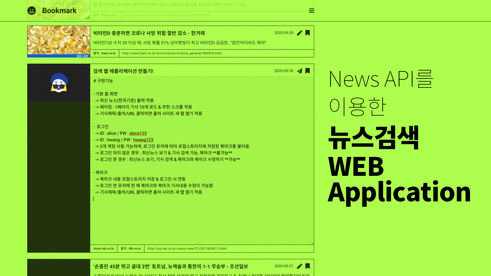

# Alyce Health Cording Test

NewsAPI를 이용한 뉴스 검색 웹 애플리케이션

## 구현기능

### 기본 홈 화면 & 검색

- 기본 화면 : 최신뉴스(한국기준) 출력 적용
- 검색어 입력 & 결과 출력
- 페이징 : 1페이지 기사 10개 불러오기 & 무한 스크롤 적용
- 기사제목 / 출처 / URL 클릭 → 새 탭으로 페이지 열기

### 로그인

| no  | ID    | password |
| --- | :---- | :------- |
| 1   | alyce | alyce123 |
| 2   | hwang | hwang123 |

- 2개 계정 사용 가능하며, 로그인 유저에 따라 로컬스토리지에 저장된 북마크 연동
- 로그인 하지 않은 경우 : 최신뉴스 보기 & 기사 검색 가능,  **북마크 불가능**
- 로그인 한 경우 : 최신뉴스 보기, 기사 검색 & **북마크, 북마크 수정 가능**

### 북마크 & 북마크 페이지

- **북마크 기사 내용 수정 및 저장**
- 로그인 시 북마크 아이콘 활성화
- 북마크 기사 로컬스토리지 저장
- 홈 화면 또는 검색한 뉴스 목록 북마크 추가 & 제거
- 기사제목 / 출처 / URL 클릭 → 새 탭으로 페이지 열기
